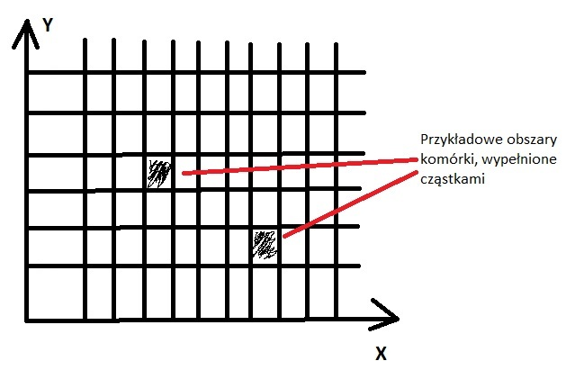

# Implementacja w iteracji #2

Druga faza implementacji symulatora komórki. 
Głównym wyzwaniem tej fazy było opracowanie metody korzystania z istniejących baz danych, wypełnianych przez profesjonalnych badaczy:
TODO: REFERENCE DO TYCH BAZ DANYCH, tutaj albo na stronie głównej

## Implementacja zaproponowana przez zespół pierwszy (Ławski, Warchoł)

Zespół ten zajął się opracowaniem metody korzystania z dostarczonej bazy danych, oraz jej integracji z istniejącym rdzeniem aplikacji.
Zadaniem tego zespołu było również analizą stochiometrii. Polegało to na ustaleniu ogólnego stosunku ilościowego cząstek, 
tak aby było możliwe ich dyskretna reprezentacja w systemie(cząstka - obiekt). Analiza wykazała, że rząd wielkości ilości potrzebnych cząstek
wynosi ~1010, co zgadza się z teoretyczną wiedzą prowadzącego. Tak duża liczba cząstek przedstawia poważny problem w kwestii zużycia
pamięci operacyjnej, zaistniała więc potrzeba zrównoleglenia działania aplikacji. 

## Implementacja zaproponowana przez zespół drugi (Gajewski, Zygmunt)

Zespół skoncentrował się na opracowaniu metody korzystania z dostarczonej bazy danych. 
Zdecydowano się również na połączenie tworzonego elementu symulacji z pozostałymi zespołami, poprzez próbę tłumaczenia
określonych sekwencji kodu DNA na konkretne cząstki, używane w symulacji.

## Implementacja zaproponowana przez zespół trzeci (Makówka, Węgrzyński)

Zespół zajął się pełnym ukończeniem implementacji symulacji cyklu Krebsa.
Podjęte zostały próby uwzględnienia nowych czynników takich jak błona komórkowa.
Użyty został również wzorzec projektowy strategia w celu przygotowania aplikacji na pobór danych z różnych źródeł, takich jak pliki w formacie json czy też inne związane z konkretną implementacją bazy danych.

Prace nad implementacją aplikacji zostały następnie zamrożone, na rzecz utworzenia dokumentacji projektu.
Tworzona dokumentacja ma na celu zachowanie:
 - wiedzy eksperckiej przedstawionej podczas trwania zajęć
 - rozwiązań zaimplementowanych i zaproponowanych przez zespół realizujący projekt
 
Efektem prac nad dokumentacją jest obecnie przeglądaną stroną.

## Podsumowanie iteracji

Reasumując, w iteracji tej utworzona została dokumentacja projektu, zintegrowane zostały zewnętrzne źródła danych oraz wykonana została
próba przekształcenia aplikacji dotychczas jednowątkowej w aplikację wielowątkową.

Urównoleglenie aplikacji okazało się być nie trywialnym problemem. Rozważane było kilka podejść do tego zagadnienia:
- podejście przestrzenne zakładające uaktywnienie parametru położenia cząstek. Podejście to zakłada podzielenie zasobów komórki - tzw. worka
na mniejsze worki, z uwzględnieniem pozycji tych mniejszych obszarów względem siebie. Wstępnie, pozycje cząstek w tym modelu były by generowane automatycznie, poprzez losowanie.
- podejście nie przestrzenne, zakładające podział komórki na worki nie mające odwzorowanie przestrzennego

Przykładowy model podejścia przestrzennego(na wzór szachownicy):

Ważnymi parametrami rozważnych modeli jest także komunikacja pomiędzy wątkami. W czasie implementacji poruszone zostały zagadnienia takie jak:
- uwzględnienia czasu jako kroku symulacji - model synchroniczny/asynchroniczny, model asynchroniczny pozwala na uproszczenie komunikacji
- ilość oraz postać przesyłanych informacji, jakie dane będą synchronizowane?
- częstotliwość komunikacji
  - ustalana statycznie - co X kroków następuję wymiana informacji
  - ustalana przez algorytm - wywoływana np. określonym poziomem parametrów(np. duża ilość cząstek relatywnie do sąsiadów)