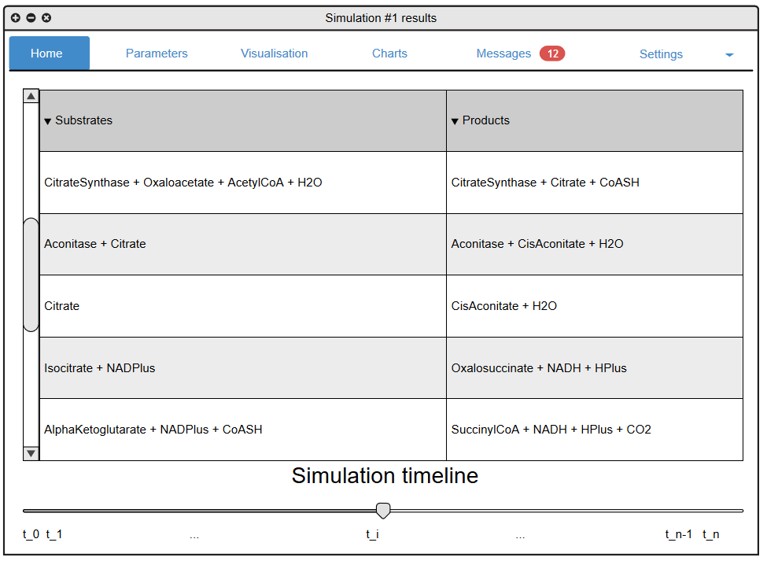
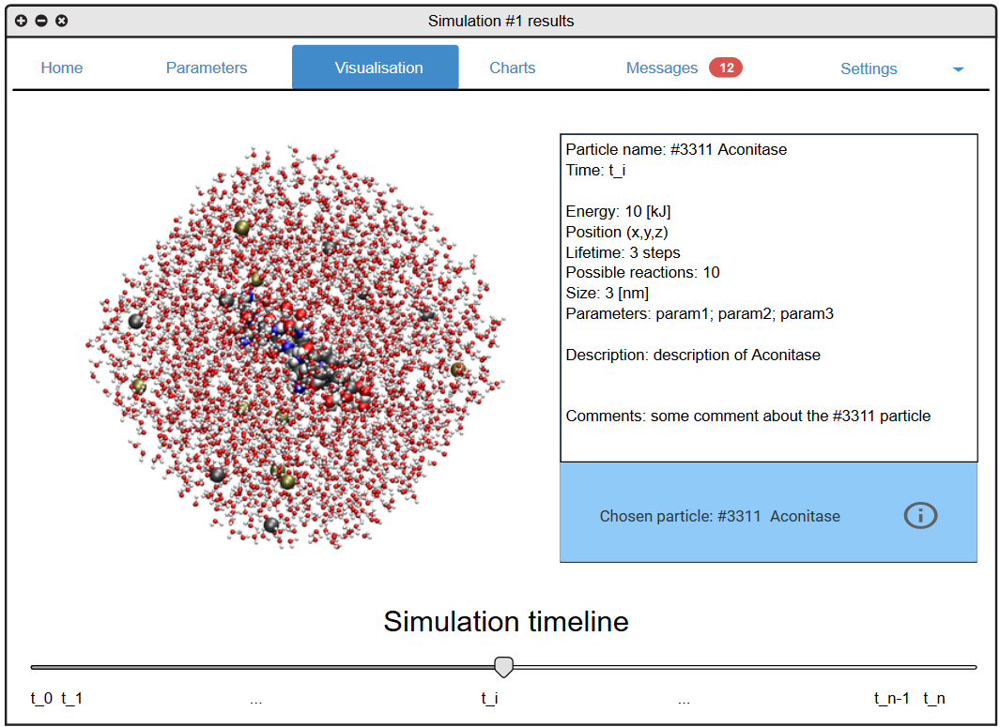
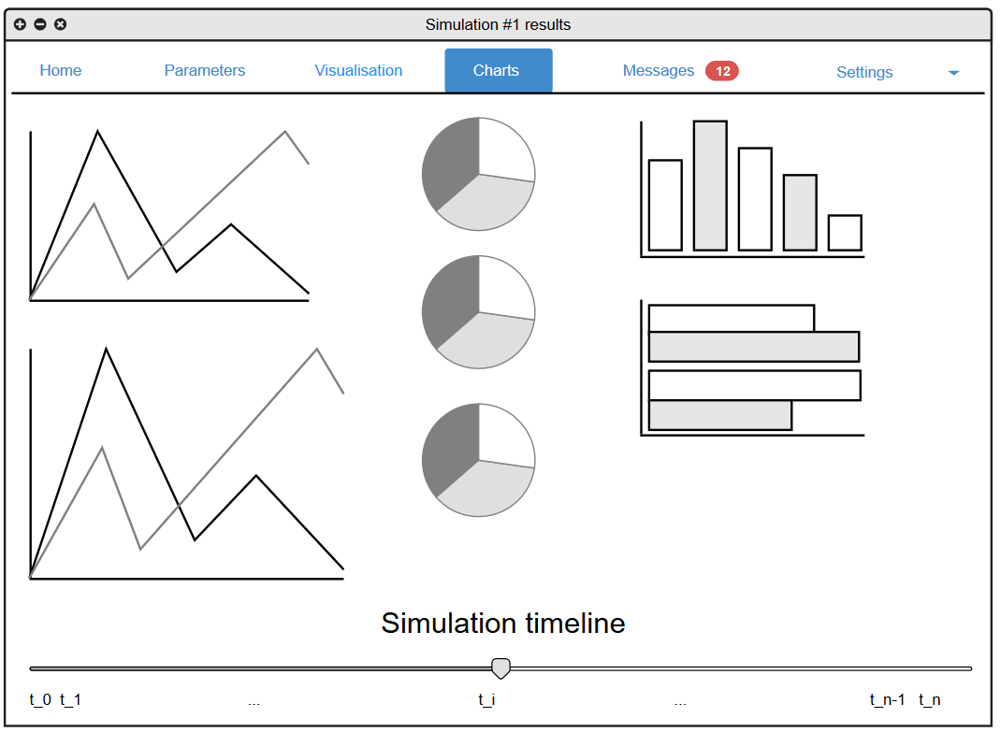
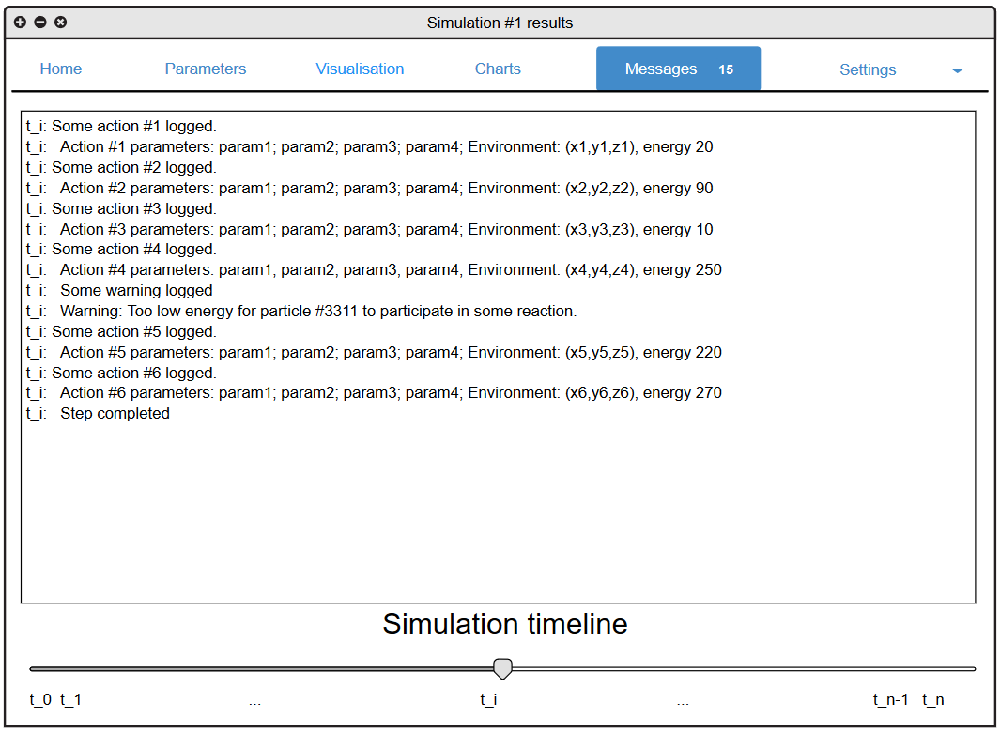

[Powrót do strony głównej](index)
# Wizja rozwiązania

## Wstęp

Realizacja projektu, wymagała przygotowania mockupów prezentujących wizję oprogramowania opracowaną przez jej projektantów, w celu zaprezentowania jej zarówno osobom nadzorującym projekt, jak również programistom i grafikom komputerowym, odpowiedzialnym za jego wytworzenie. 
W dalszej części, przedstawione więc zostały zarówno poglądowe ilustracje tego co powinno się znaleźć w programie, jak również opisy koniecznych ekranów i funkcji. 

## Opis

Some description

## Mockup's

Illustration 1. The home window in simulation results.

Ilustracja powyżej przedstawia domyślne okno z rezultatami pewnej symulacji przeprowadzonej w pewnej komórce na pewnym zbiorze cząstek pod pewnymi warunkami. 
W tym oknie widoczne są menu górne, odpowiedzialne za przełączanie pomiędzy możliwymi formatami prezentacji wyników oraz parametrów symulacji, główne okno z pewnymi danymi (np. wykonanymi reakcjami) oraz na dole - pasek 'timeline', którego przesuwanie odpowiada za wybór momentu symulacji (czasu), dla którego mają zostać zaprezentowane warunki środowiskowe oraz stan symulacji. 

Illustration 2. The visualisation window in simulation results.

Podobnie jak na Ilustracji 1 menu górne oraz pasek czasu są również dostępne, natomiast w oknie głównym wyświetlana jest wizualizacja stanu komórki w pewnym czasie t_i w symulacji #k. Wizualizacja ta ma być możliwie czytelna dla użytkowników programu, powinna być konfigurowalna (łatwe obracanie układu) oraz trójwymiarowa. Wybierając (klikając) w pewną wybraną czastkę, wyświetlane są (w odpowiednim polu tekstowym) jej parametry. 
Rozważyć nalezy również, oprócz wyboru konkretnej cząstki, wybór cząstek z konkretnego obszaru i ich grupowy podgląd (np. badanie ich wspólnej energii, stanu, gęstości czy innych parametrów). 

Illustration 3. The charts window in simulation results.

W oknie "Charts" przedstawionym na ilustracji 3 zachowane zostaje menu górne i pasek postepu czasu, natomiast w oknie głównym prezentowane są użytkownikowi różne wykresy związane z postępem symulacji - jest to o tyle istotna zakładka, gdyż wykresy również stanowią ważną część wizualnej reprezentacji stanu symulacji. 

Illustration 4. The messages window in simulation results.

Na ilustracji 4 przedstawiona została zakładka Messages, w której wyświetlone zostają wszystkie logi związane z postępem symulacji - jest to mało czytelna forma prezentowania stanu symulacji jednak jest przydatna podczas dokladnej analizy zachowania poszczególnych cząstek (szczególnie nietypowego). 