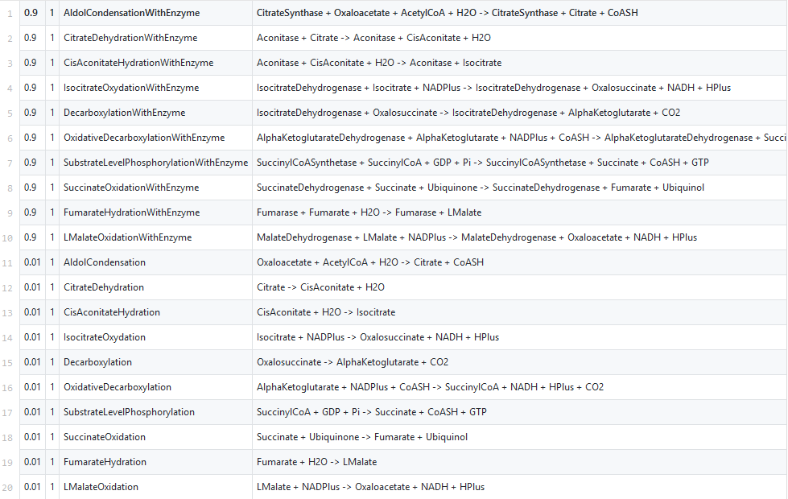
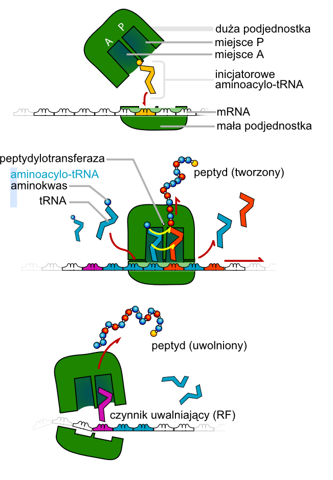
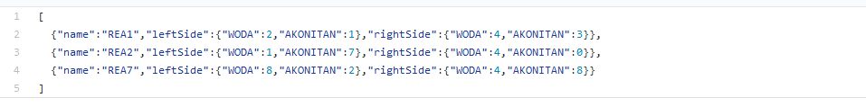

[Powrót do strony głównej](index)
# Detale techniczne

## Model symulacyjny

Tworzony model symulacyjny będzie systemem dyskretnym, tworzonym na wzór automatu skończonego.

Modelowanie będzie polegać na obliczaniu stanu komórki w poszczególnym krokach symulacji, które mogą reprezentować upływ czasu.

## Wizualizacja

Rozważana jest dwuwymiarowa wizualizacja modelowanej komórki lub jej części, natomiast nie została ona jeszcze zaprojektowana ani zaimplementowana.

## Wykorzystywane technologie

- Java 1.8
- JavaFX
- Gradle
- Jackson
- Guice

## next

# Implementacja w iteracji #1

Pierwsza faza implementacji symulatora komórki:

## Implementacja zaproponowana przez zespół pierwszy (Ławski, Warchoł)

Zespół pierwszy zajął się implementacji symulacji cyklu Krebsa. 

Wykorzystał do tego następujące narzędzia: Java, Maven. 

W ramach wykonywanego symulatora, zespół stworzył bazę reakcji wykorzystywanych w cyklu Krebsa. Baza ta stanowiła dobrą bazę w ramach prac w pierwszej iteracji. 
Została ona wykorzystana w pracach zespołu trzeciego, który zmienił format zapisu reakcji na format JSON, z uwzględnieniem innych, dodatkowych, parametrów.

Wspomniana baza reakcji została przedstawiona na ilustracji poniżej: 

## Implementacja zaproponowana przez zespół drugi (Gajewski, Zygmunt)

Zespół zajmował się implementacją translacji czyli procesu syntezy łańcucha polipeptydowego białek na matrycy mRNA. W wyniku tej operacji dochodzi do ostatecznego przetłumaczenia informacji genetycznej
zawartej pierwotnie w kodzie genetycznym DNA na konkretną strukturę białka, zależną od uszeregowania aminokwasów w łańcuchu polipeptydowym. 

Realizacja tego zadania była utrudniona, ze względu na trudną dostępność potrzebnych informacji (sekwencji genów) oraz różny format ich zapisu. 
Pewna ograniczenia techniczne wymusiły na zespole poszukiwanie danych z dodatkowym ograniczeniem na ich format - jedynie możliwe do wykorzystania w tym przypadku okazały się sekwencje w formacie FASTA. 

Mimo napotkanych trudności, zespół zrealizował translację, której rezultaty były zapisywane do pliku: ... 
Przykład wyniku działania omawianego modułu został przedstawiony na ilustracji poniżej:

TODO.... ilustracja.

Schemat translacji w podejściu teoretycznym:

za wikipedia.org

Schemat translacji w podejściu implementacyjnym: 

TODO....ilustracja

## Implementacja zaproponowana przez zespół trzeci (Makówka, Węgrzyński)

Trzeci zespół, podobnie jak pierwszy, również odpowiedzialny był na implementację symulacji cyklu Krebsa. Doktor nadzorujący prace, chciał bowiem wprowadzić do prac element konkurencji, tak by otrzymać kilka rywalizujących ze sobą rozwiązań i wybrać najlepsze z nich. 
Sukces tej rywalizacji należy uznać za umiarkowany, gdyż oba zespoły zastosowały podobne podejście do rozwiązania problemu, które bazowało na teorii zaprezentowanej na zajęciach seminaryjnych a różnice dotyczyły głównie kwestii technicznych (użyte narzędzia, struktura programu). 
Mimo to, udało się znaleźć pewne słabości jednej i drugiej symulacji i w ramach dalszych prac, zespoły miały połączyć siły, jednocześnie dokonując syntezy najlepszych pomysłów z obu prac. 

Ten zespół, zaproponował swój format zapisu reakcji oraz struktury programu, który polegał na wykorzystaniu narzędzia automatyzującego budowę oprogramowania - Gradle. Na format zapisu rekacji został natomiast wybrany JSON, który wydawał się zdecydowanie bardziej czytelny dla wielu reakcji o wielu różnych parametrach. 
Zapis reakcji tego zespołu został przedstawiony na ilustracji poniżej:

Przykład wyniku działania omawianego modułu przedstawia ilustracja poniżej:

TODO ilustracja .... 