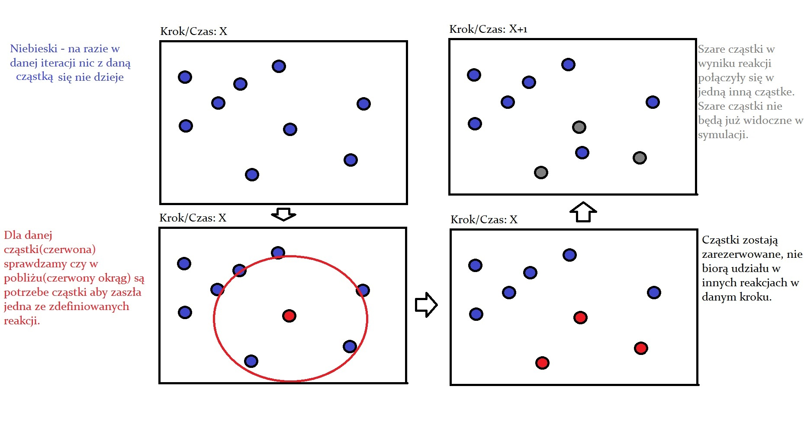

[Powrót do strony głównej](index)
# Detale techniczne

## Model symulacyjny

Tworzony model symulacyjny będzie systemem dyskretnym, tworzonym na wzór automatu skończonego.

Modelowanie będzie polegać na obliczaniu stanu komórki w poszczególnym krokach symulacji, które mogą reprezentować upływ czasu.

Poniższa ilustracja przedstawia idee modelu symulacyjnego:

## Wizualizacja

Rozważana jest dwuwymiarowa wizualizacja modelowanej komórki lub jej części, natomiast nie została ona jeszcze zaprojektowana ani zaimplementowana.

## Wykorzystywane technologie

- Java 1.8
- JavaFX
- Gradle
- Jackson
- Guice

# Implementacja w iteracji #1

Pierwsza faza implementacji symulatora komórki:

## Implementacja zaproponowana przez zespół pierwszy (Ławski, Warchoł)

Zespół pierwszy zajął się implementacji symulacji cyklu Krebsa. 

Wykorzystał do tego następujące narzędzia: Java, Maven. 

W ramach wykonywanego symulatora, zespół stworzył bazę reakcji wykorzystywanych w cyklu Krebsa. Baza ta stanowiła dobrą bazę w ramach prac w pierwszej iteracji. 
Została ona wykorzystana w pracach zespołu trzeciego, który zmienił format zapisu reakcji na format JSON, z uwzględnieniem innych, dodatkowych, parametrów.

Wspomniana baza reakcji została przedstawiona na ilustracji poniżej: 

[Rezultat działania programu dla cyklu Krebsa](team1_iteration1_results)

## Implementacja zaproponowana przez zespół drugi (Gajewski, Zygmunt)

Zespół zajmował się implementacją translacji czyli procesu syntezy łańcucha polipeptydowego białek na matrycy mRNA. W wyniku tej operacji dochodzi do ostatecznego przetłumaczenia informacji genetycznej
zawartej pierwotnie w kodzie genetycznym DNA na konkretną strukturę białka, zależną od uszeregowania aminokwasów w łańcuchu polipeptydowym. 

Realizacja tego zadania była utrudniona, ze względu na trudną dostępność potrzebnych informacji (sekwencji genów) oraz różny format ich zapisu. 
Pewna ograniczenia techniczne wymusiły na zespole poszukiwanie danych z dodatkowym ograniczeniem na ich format - jedynie możliwe do wykorzystania w tym przypadku okazały się sekwencje w formacie FASTA. 

Mimo napotkanych trudności, zespół zrealizował translację, której rezultaty były zapisywane do pliku: ... 
Przykład wyniku działania omawianego modułu został przedstawiony na ilustracji poniżej:

TODO.... ilustracja.

Schemat translacji w podejściu teoretycznym:

za wikipedia.org

Schemat translacji w podejściu implementacyjnym: 

TODO....ilustracja

## Implementacja zaproponowana przez zespół trzeci (Makówka, Węgrzyński)

Trzeci zespół, podobnie jak pierwszy, również odpowiedzialny był na implementację symulacji cyklu Krebsa. Doktor nadzorujący prace, chciał bowiem wprowadzić do prac element konkurencji, tak by otrzymać kilka rywalizujących ze sobą rozwiązań i wybrać najlepsze z nich. 
Sukces tej rywalizacji należy uznać za umiarkowany, gdyż oba zespoły zastosowały podobne podejście do rozwiązania problemu, które bazowało na teorii zaprezentowanej na zajęciach seminaryjnych a różnice dotyczyły głównie kwestii technicznych (użyte narzędzia, struktura programu). 
Mimo to, udało się znaleźć pewne słabości jednej i drugiej symulacji i w ramach dalszych prac, zespoły miały połączyć siły, jednocześnie dokonując syntezy najlepszych pomysłów z obu prac. 

Ten zespół, zaproponował swój format zapisu reakcji oraz struktury programu, który polegał na wykorzystaniu narzędzia automatyzującego budowę oprogramowania - Gradle. Na format zapisu rekacji został natomiast wybrany JSON, który wydawał się zdecydowanie bardziej czytelny dla wielu reakcji o wielu różnych parametrach. 
Zapis reakcji tego zespołu został przedstawiony na ilustracji poniżej:

Przykład wyniku działania omawianego modułu przedstawia ilustracja poniżej:

TODO ilustracja .... 

## Podsumowanie iteracji

W iteracji tej udało się rozpocząć pracę na poszczególnymi modułami, zaczynając w prostej formie z racji skomplikowania zagadnienia i edukacyjnego charakteru zajęć.

Jako wniosek iteracji, zespół postanowił ustalić wspólny rdzeń systemu, którym jest model danych. 
Ustalenie wspólnego rdzenia ma za zadanie pomóc w realizacji integracji pracy wszystkich zespołów.

Ustalony model danych reprezentuje się następująco:

Opisy oraz uzasadnienia:
- Komórka(Cell) jest reprezentowana jako "worek" zasobów, bez uwzględniania innych parametrów takich jak położenie poszczególnych cząstek, błona komórka czy inne elementy komórki priokariotycznej
- Zbiór zasobów(ResourcePool) będący dekoratorem mapy. Zasoby komórki są reprezentowane jako typ komórki(ParticleType) będącym obecnie typem słownikowym, oraz listę cząstek.
Długość listy cząstek reprezentuje ilość cząstek w danym zbiorze. Taka konstrukcja pozwala na przydzielenie różnych parametrów do wielu cząstek tego samego typu, np. ich rozmieszczenie w komórce.
- Cząstka(Particle, metabolit?) podstawowa jednostka na podstawie której zachodzą reakcje. Cząstka może być substratem, produktem lub enzymem danej reakcji.
 Cząstki są reprezentowane jako atomowe byty, nie istnieje ani nie jest planowany ich podział na poszczególne molekuły oraz ich połączenia.
 Opis cząstki zawiera jej nazwę(łańcuch znakowy jednoznacznie ją określający), położenie przestrzeni oraz jej energię.
 Trzeba zaznaczyć, iż w obecnej postaci systemu, parametry położenia oraz energii nie są wykorzystywane.
- Położenie(Location) klasa zawierająca opis położenia cząstki. Obecna projekt systemu zakłada dwuwymiarowy system współrzędnych.

# Implementacja w iteracji #2

Druga faza implementacji symulatora komórki. 
Głównym wyzwaniem tej fazy było opracowanie metody korzystania z istniejących baz danych, wypełnianych przez profesjonalnych badaczy:
TODO: REFERENCE DO TYCH BAZ DANYCH, tutaj albo na stronie głównej

## Implementacja zaproponowana przez zespół pierwszy (Ławski, Warchoł)

TODO

## Implementacja zaproponowana przez zespół drugi (Gajewski, Zygmunt)

Zespół skoncentrował się na opracowaniu metody korzystania z dostarczonej bazy danych. 
Zdecydowano się również na połączenie tworzonego elementu symulacji z pozostałymi zespołami, poprzez próbę tłumaczenia
określonych sekwencji kodu DNA na konkretne cząstki, używane w symulacji.

## Implementacja zaproponowana przez zespół trzeci (Makówka, Węgrzyński)

Zespół zajął się pełnym ukończeniem implementacji symulacji cyklu Krebsa.
Podjęte zostały próby uwzględnienia nowych czynników takich jak błona komórkowa.
Użyty został również wzorzec projektowy strategia w celu przygotowania aplikacji na pobór danych z różnych źródeł, takich jak pliki w formacie json czy też inne związane z konkretną implementacją bazy danych.

Prace nad implementacją aplikacji zostały następnie zamrożone, na rzecz utworzenia dokumentacji projektu.
Tworzona dokumentacja ma na celu zachowanie:
 - wiedzy eksperckiej przedstawionej podczas trwania zajęć
 - rozwiązań zaimplementowanych i zaproponowanych przez zespół realizujący projekt
 
Efektem prac nad dokumentacją jest obecnie przeglądaną stroną.

## Podsumowanie iteracji

Brak, iteracja jest w trakcie realizacji.