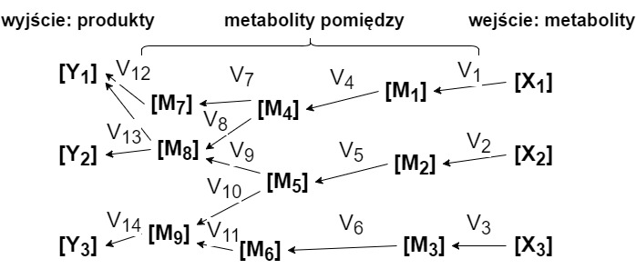
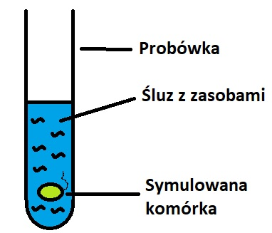
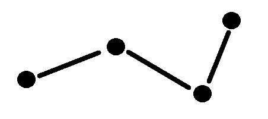
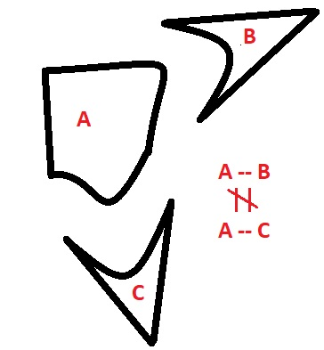

[Powrót do strony głównej](index)
# Teoria

## Wstęp

Celem projektu jest stworzenie symulacji części komórki. Symulacja ta ma się odbywać przy pomocy pewnego deterministycznego automatu skończonego jako, że symulacja przy pomocy modelowania systemu fizycznego i oddziaływań kulombowskich, czyli wszystkich cząstek oraz interakcji między nimi okazała sie jak dotąd nie skuteczna.
Ponadto symulacja przy pomocy automatu jest przypuszczalnie łatwiejsza w implementacji, i może pomóc w zdobyciu nowego spojrzenia na sposób działania komórki.

Modelowanie komórki jest zadaniem bardzo trudnym, ocenia się, że stworzenie wierniej symulacji komórki może być wielokrotnie bardziej skomplikowane od takich przedsięwzięć jak załogowa podróż na Marsa.

## Cele projektu

1. Stworzenie modelu który dobrze odwzorowuje rzeczywistość
2. Próba informatyzacji danych o komórce, zasad jej działania
3. Modelujemy fragment ale chcemy, aby był on użyteczny
4. Odkrycie mechanizmu informatycznego lub wskazówek mogących pomóc w jego odnalezieniu
5. Utworzenie konfigurowalnego modelu
6. Pokazanie symulowanych fragmentów w przejrzysty sposób 
7. Pokazanie symulowanej komórki i jej parametrów czasie t1, t2, ..., tn w możliwie czytelny sposób (zarówno graficzny jak i tekstowy). 

## Teoretyczne wymogi implementacji

1. Zamodelowanie cząsteczek
2. Wykorzystanie sztucznej inteligencji (do synchronizacji - określona temperatura, ciśnienie, układ oraz ruch cząsteczek - tak by nie było konieczności wprowadzania wszystkich parametrów dla każdej cząsteczki z osobna za każdym razem). 
3. Stworzenie języku opisu komórki 

## Istniejące źródła inspiracji w dziedzinie modelowania komórki

Zagadnieniem modelowania komórki zajmuje się wiele zespołów naukowców na całym świecie.
W trakcie trwania zajęć zostały nam przedstawione dwa takie projekty czy też aplikacje, są to:

1. CHARMM[[1]](#ref1)
2. GROMACS[[2]](#ref2)

Systemy te są oparte na symulacji fizycznych zjawisk, zachodzących w komórce i są, według wiedzy ekspertów przedstawionej w czasie trwania zajęć, mało dokładne.

Istotny wpływ na analizę problemu mogą stanowić doświadczenia naukowców zajmujących się badaną przez zespół dziedziną:

1. Natalio Krasnogor - zajmujący się modelem deterministycznym (takim, jakim zajmuje się zespół) a nie modelem kulombowskim. 
2. Elijah Roberts 
3. Jonathan Karr [http://www.karrlab.org/]

## Rodzaje komórek

Komórka, czyli najmniejsza strukturalna i funkcjonalna jednostka organizmów żywych zdolna do przeprowadzania wszystkich podstawowych procesów życiowych (takich jak przemiana materii, wzrost i rozmnażanie). Jest podstawową jednostką
morfologiczno-czynnościową ustroju. Spośród komórek należy wyróżnić komórki:

### Prokariotyczne

Mniej skomplikowany rodzaj komórki, nieposiadający jądra komórkowego oraz organelli.

Jest to rodzaj komórki który będzie przez zespół modelowany, a konkretnie będzie to pałeczka okrężnicy (w skrócie z ang. E. coli).
Wybór ten uzasadniamy ogromną wiedzą zdobytą na temat tej komórki, która jest dostępna w różnego rodzaju zbiorach danych oraz publikacjach.

Ilustracja 1[[3]](#ref3) - Struktura komórki prokariotycznej

Legenda:
1. kapsuła
2. ściana komórkowa
3. błona komórkowa
4. cytoplazma
5. rybosomy
6. mezosom
7. DNA
8. wić

### Eukariotyczne

Bardziej skomplikowany typ komórki. Komórki tego rodzaju tworzą organizmy wielokomórkowe, czyli między innymi ludzi.
Zespół nie będzie zajmował się symulacją tego typu komórki ze względu na ograniczenia czasowe oraz poziom jej skomplikowania.

## Powielanie komórkowe

Ze względu na modelowanie jedynie fragmentu komórki, zespół nie będzie zajmował się zagadnieniem powielania komórkowego.
Synchronizacja powielania komórkowego jest trudnym zagadnieniem.

## Model przestrzenny wnętrza komórki

Brane pod uwagę są dwie możliwości:
- komórka jest reaktorem, maszynerią, sprowadza się to do założenia, że cząstki znajdujące się w komórce 'przeszkadzają'
sobie na wzajem, np. poprzez zajmowanie istotnego miejsca
- komórka jest workiem dyfudującym, cząstki nie przeszkadzają sobie na wzajem w reakcjach, jest to łatwiejszy w modelowaniu wariant

Wiedza ekspertów przedstawiona podczas trwania zajęć sugeruję, że nie do końca wiadomo, która z powyższych opcji jest prawdziwa w naturze.
Sugerowane jednak było, że podejście mówiące o komórce jako rektorze jest bliższe prawdzie.

## Metabolizm bakterii

### Systemy

- Dynamiczne: kilka elementów
- Termodynamiczne: wiele elementów, jeden rodzaj interakcji
- Biologiczne: zbiór różnych elementó, hierarchiczny, bogaty zbiór interkacji
- Równania Maxwella
- Linear flux-force relationship
- Phosphorylation potential
- Free energy of ATP hydrolysis: zmiany ATP, ADP i Pi są różna dla różnych warunków

### Podsumowanie

Nie ma drogi na skróty, wiele znanych rozwiązań okazuje się nieskutecznych, trzeba tworzyć skomplikowane modele aby uzyskać dużą dokładność.

### Schemat systemu do którego zespół dąży

Ilustracja 2 - schemat systemu odpowiadającego za metabolizm(?) przedstawiony przez Prof. Bernarda Korzeniowskiego

Objaśnienia:
- przepływy/szybkości reakcji określane przez symbol V np. V1
- stężenie metabolitów określane przez [X]
- kinetyki poszczególnych reakcji np. V3=f(Xi,...,Aj)

## Zaproponowana interaktywna metoda budowy modelu:

- zbierz dane o konkretnych częściach systemu
- wystosuj założenia i przybliżenia
- stworzenie modelu na komputere(tymczasowy)
- wielokrotne testy(z dostępnych źródeł)
- w razie potrzeby modyfikacja modelu

## Docelowy model

Zespół dąży do utworzenia modelu nie tylko komórki, ale też jej otoczenia.
Ważne jest bowiem uwzględnienie uzyskiwania zasobów przez komórkę, z jej otoczenia.

Ilustracja 3 - poglądowy rysunek modelu

## Cząstki

### Rodzaje cząstek

- cząsteczki a, proste, mają identyczny wzór chemiczny oraz strukturę przestrzenną

- cząsteczki b, złożone i długie, bardzo powtarzalna struktura

Cząstką może być substrat, produkt lub enzym reakcji. W zależności od konkretnego przypadku będzie on przechowywany jako cząstka typu a lub b.

### Parametry cząstki

- identyfikator pozwalający na jednoznaczne określenie cząstki, może to być
    - liczba
    - nazwa cząstki
    - wzór cząstki
    
- położenie cząstki w komórce, w zależności od poziomu skomplikowania modelu może to być
    - położenie w dwuwymiarowym układzie współrzędnych(2D)
    - położenie w trójwymiarowym układzie współrzędnych(3D)
    
- energia cząstki
    - odwzorowanie i zachowanie bilansu energetycznego reakcji
    
- stany logiczne
    - np. przyłączenie cząstki pod innym kątem może dać inny rezultat

Ilustracja 4 - przykładowy wpływ stanu logicznego na reakcję
    

### Parametry reakcji

- zmiana parametrów cząstki
    - zmiana położenia(przemieszczenie)
    - zmiana energii
    - zmiana stanu logicznego
- usunięcie cząstki z zasobów, może by wywołane:
    - złączeniem danej cząstki z inną
    - uwolnieniem cząstki
- dodanie nowej cząstki do zasobów
    - pobranie zasobów z otoczenia
- determinizm lub jego celowy brak
    - determinizm: reakcja zachodzi zawsze jeżeli są dostępne zasoby
    - brak determinizmu: istnieje pewna szansa na zajście reakcji mimo dostępnych zasobów
- reakcja rezerwuje cząstki biorące w niej udział
    - oznacza to, że są one wykluczone z zasobów do następnego kroku symulacji
- odwracalność reakcji
    
    
    

## Referencje

<small><a name="ref1">[1]</a> - https://www.charmm.org/charmm/?CFID=068e59f1-2efe-4c72-b565-749e2ef55079&CFTOKEN=0</small>
 
<small><a name="ref2">[2]</a> - http://www.gromacs.org/</small>
 
<small><a name="ref3">[3]</a> - https://pl.wikipedia.org/wiki/Kom%C3%B3rka_prokariotyczna#/media/File:Prokaryote_cell_diagram_international.svg</small>

